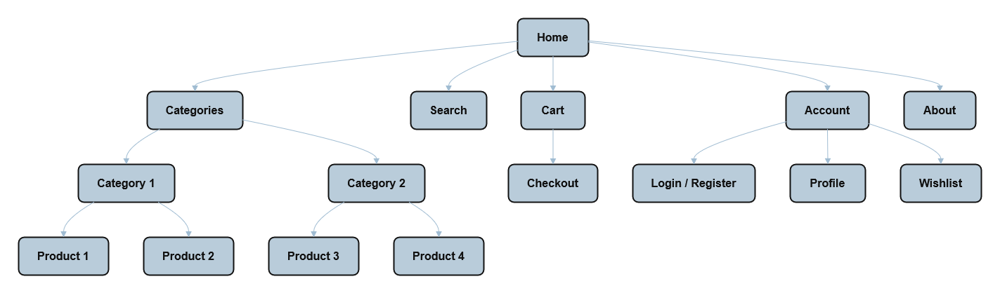

# User personas and information architecture

- [User Personas](#user-personas)
  - [Persona 1 – Marija Kovačević](#‍%EF%B8%8F-persona-1-marija-kovačević--the-practical-shopper)
  - [Persona 2 – Luka Horvat](#‍%EF%B8%8F-persona-2-luka-horvat--the-busy-professional)
  - [Persona 3 – Ana Radić](#‍%EF%B8%8F-persona-3-ana-radić--the-student-on-a-budget)
- [Sitemap](#sitemap)

## User Personas

### 🧍‍♀️ Persona 1: **Marija Kovačević – The Practical Shopper**

**Age:** 56  
**Location:** Osijek, Croatia  
**Occupation:** Primary school teacher  
**Tech skill level:** Low to medium

#### 👩 Background

Marija enjoys shopping online but often finds popular e-commerce sites confusing. She sometimes asks her children to help her complete an order because she gets lost among too many buttons, pop-ups, and categories. She values clear, simple interfaces and quick checkout processes.

#### 🎯 Goals

- Find and buy everyday items (clothes, small home goods) easily.
- Avoid complicated navigation and account setups.
- Feel confident completing a purchase independently.

#### 😣 Frustrations

- Overwhelming websites with unnecessary features.
- Hidden fees and unclear delivery information.
- Complex password and login systems.

#### 💬 Quote

> “I just want to find what I need, pay for it, and be done in a few clicks.”

---

### 🧍‍♂️ Persona 2: **Luka Horvat – The Busy Professional**

**Age:** 32  
**Location:** Zagreb, Croatia  
**Occupation:** Marketing specialist  
**Tech skill level:** High

#### 👨 Background

Luka works long hours and doesn’t have time to browse multiple sites for the best deals. He’s tech-savvy and values efficiency. He uses mobile devices for most purchases and prefers platforms that save him time.

#### 🎯 Goals

- Quickly find and purchase what he needs during breaks or commutes.
- Use a website that loads fast and has a clean interface.
- Have saved preferences for faster repeat shopping.

#### 😣 Frustrations

- Websites overloaded with banners, ads, and slow load times.
- Complicated checkout processes requiring multiple steps.
- Too many emails and promotional pop-ups.

#### 💬 Quote

> “If I can order food in 30 seconds, I should be able to buy headphones just as fast.”

---

### 🧍‍♀️ Persona 3: **Ana Radić – The Student on a Budget**

**Age:** 21  
**Location:** Split, Croatia  
**Occupation:** University student (Economics)  
**Tech skill level:** Medium

#### 👩 Background

Ana often shops online for affordable fashion and study supplies. She’s comfortable using technology but dislikes platforms that feel cluttered or pushy. She prefers websites that are trustworthy, transparent, and visually clean.

#### 🎯 Goals

- Find affordable, reliable products easily.
- Have a smooth experience on both mobile and desktop.
- Save products for later and track prices.

#### 😣 Frustrations

- Too many ads and unnecessary steps before checkout.
- Confusing return or shipping policies.
- Websites that look outdated or unsafe.

#### 💬 Quote

> “I don’t have time to figure out complicated websites. I just want to buy what I need and move on.”

---

### 🧩 Prompt

**LLM Prompt:**

> Create 3 user personas for my website. Here is a useful link about user personas: [https://www.youtube.com/watch?v=XnG4c4gXaQY](https://www.youtube.com/watch?v=XnG4c4gXaQY), and here's the summary of my website (write user personas in English, but they should be from Croatia):
>
> Ime aplikacije izgrađene u sklopu ovog projekta je QuickBuy. Ova aplikacija rješava problem prekomjerne složenosti online trgovina. Mnoge platforme za online kupovinu su nepotrebno složene za prosječne korisnike koji traže brzo i jednostavno iskustvo kupnje. Ciljani korisnici ove aplikacije su osobe svih dobnih skupina, s posebnim naglaskom na tehnički manje vješte korisnike. Cilj ovog projekta je izgradnja jednostavne i pregledne web aplikacije koja omogućava korisnicima brz pronalazak i kupnju proizvoda bez nepotrebnih smetnji. Ideja za ovu aplikaciju proizašla je iz stvarne situacije u kojoj je jedan od članova tima primijetio poteškoće kod svojih roditelja prilikom korištenja jedne od online shopping platformi.

## Sitemap

