# QuickBuy — Final Project Report

## 1. Introduction

### 1.1 Background and Context

The application developed as part of this project is named **QuickBuy**. It is an
e-commerce web application whose product data originates from the public
DummyJSON products dataset but is now owned and served by the project's own
infrastructure. The application was conceived in response to a recurring
observation about mainstream online shopping platforms: that they have become
considerably more complex than the task they exist to support. Feature-dense
navigation, aggressive promotional interfaces, intrusive modal flows, and deep
menu hierarchies impose a cognitive cost on users who simply want to locate a
product and purchase it.

The concrete motivation for QuickBuy came from a real situation in which a member
of the team observed an older relative struggling to complete a routine purchase
on a popular online store. The difficulty was not a lack of willingness to shop
online, but the amount of incidental complexity standing between the user and a
simple goal.

### 1.2 Purpose and Objectives

The purpose of the project is to design and build a shopping web application that
is deliberately simple and predictable to use. The primary objectives are:

- to allow users to find products quickly, through direct search and a small,
  well-structured set of filters, rather than through elaborate navigation;
- to keep every screen focused on a single task, with a consistent visual
  language and no non-essential interface elements;
- to give continuous, legible feedback about system state, so that users are
  never left uncertain about whether an action succeeded;
- to make the interface usable by people across age groups and levels of
  technical confidence, including users who are not comfortable with dense or
  unconventional interfaces;
- to demonstrate a modern, server-first web architecture in which the data
  layer, the authentication layer, and the editorial content layer are each
  handled by an appropriate managed service.

### 1.3 Problem Statement

Many online shopping platforms are more complicated than they need to be for the
average user. Users who want a fast and straightforward shopping experience are
required to navigate interfaces that prioritise merchandising density and
feature breadth over clarity. This disproportionately affects less
technically-proficient users, for whom unfamiliar patterns and unclear system
feedback become genuine obstacles to completing a purchase. QuickBuy addresses
this problem by providing a focused shopping interface in which the common
tasks — searching, filtering, viewing a product, adding it to a cart, and saving
it for later — are made obvious, consistent, and reversible.

### 1.4 Scope

**In scope.** The project delivers a complete browsing and selection experience:
a curated home page (best deals, top-rated items, low-stock items, category
navigation), a shop page with search, filtering, sorting and pagination, and
product detail pages with an image gallery, specifications, and a read-only
review summary. It includes an instant search experience with autocomplete and
per-user history, a shopping cart that works for anonymous visitors and
synchronises to the database once a user signs in, a logged-in favourites list,
authentication against a small set of demo accounts, and an editorial content
layer managed through an embedded headless CMS. The application is responsive,
provides loading, error and empty states throughout, and degrades gracefully
when a backend request fails.

**Out of scope.** Three functional areas were intentionally excluded and are
represented in the interface only as non-functional stubs:

- **Full sign-up.** The sign-up form performs complete client-side validation
  but does not create an account; submission produces an informational message.
  The only usable accounts are three demo users seeded directly into the
  authentication provider. Email verification, password reset, and third-party
  (OAuth) sign-in are not implemented.
- **Checkout.** The cart's "Proceed to Checkout" control produces an
  informational message. There is no address entry, payment capture, order
  creation, or order history.
- **Writing product reviews.** Reviews are displayed from stored data only.
  There is no interface for a user to submit a rating or a written review.

Additionally, there is no administrative interface for inventory or catalogue
management (the catalogue is provisioned through database migrations), and no
real payment or shipping integration.

### 1.5 Key Features Implemented

- An owned product catalogue (194 products, 24 categories, 582 reviews) served
  from a managed PostgreSQL database, replacing a dependency on a third-party
  API.
- Instant search with combined category and product autocomplete, request
  debouncing and cancellation, and full keyboard navigation.
- Per-user recent searches and recently-viewed products, held in browser storage
  for guests and merged into the user's account on first login.
- A shop page with URL-driven filtering (category, price range, minimum rating
  with live result counts, on-sale, low-stock), seven sort orders, removable
  active-filter chips, and pagination.
- A shopping cart that works anonymously via browser storage and synchronises to
  the database when the user is signed in, using optimistic updates and an
  undo action on item removal.
- A logged-in favourites list, including a deferred "save this item after you
  log in" flow for guests.
- Authentication through Supabase Auth (three demo accounts), a header account
  menu, and client-side route protection for account-only pages.
- A Sanity headless CMS for all editorial content, with the editing environment
  embedded at `/studio` and cache invalidation driven by webhooks.
- A server-first architecture (Next.js App Router with React Server Components),
  Tailwind-based responsive layouts, skeleton loading states, and graceful
  fallback content when a backend call fails.

### 1.6 Technologies and Tools

| Layer                | Technology                                                                                              |
| -------------------- | ------------------------------------------------------------------------------------------------------- |
| Framework            | Next.js 16 (App Router, React Server Components, Turbopack)                                             |
| UI runtime           | React 19                                                                                                |
| Language             | TypeScript 5                                                                                            |
| Styling              | Tailwind CSS v4, with a small monochrome design-token system                                            |
| Component primitives | Base UI (`@base-ui/react`), shadcn-style component wrappers, `lucide-react` icons                       |
| Data & auth          | Supabase (managed PostgreSQL, PostgREST, Row-Level Security, Supabase Auth) via `@supabase/supabase-js` |
| Content              | Sanity headless CMS via `next-sanity`, with an embedded Sanity Studio                                   |
| Fonts                | Geist and Inter, served through `next/font`                                                             |
| Package manager      | pnpm                                                                                                    |
| Testing              | Playwright                                                                                              |

### 1.7 Report Structure

Section 2 identifies the visual and interaction design principles that guided the
project and shows, with concrete code references and screenshots captured from
the running application, how each is realised. Section 3 describes the three
functional areas the brief singled out: the search experience, shop filtering
and sorting, and the cart and favourites features. Section 4 explains the data
layer: why Supabase was chosen and what the database holds. Section 5 covers the
editorial content layer: the rationale for a headless CMS and what content it
manages. Section 6 reports the site's measured performance and the methods used
to achieve it, and Section 7 summarises the report. All screenshots in this
report were captured from the running application using Playwright.

---

## 2. Design Principles in Practice

The interface was evaluated against the CRAP visual principle of proximity,
Norman's interaction principles — visibility, feedback, constraints, natural
mapping, consistency, affordances and signifiers, and mental models — and common
usability rules such as Fitts's and Hick's laws. Each subsection below takes one
principle, describes it briefly, explains how it is implemented in QuickBuy with
reference to the relevant part of the codebase, and shows it in the running
application.

A note that applies throughout: QuickBuy uses a strictly **monochromatic**
palette defined as design tokens in `app/globals.css` (a near-white background,
near-black foreground, and a single mid-grey for secondary text and borders).
Colour is therefore never the only carrier of meaning, every screen passes a
grayscale check by construction, and hierarchy has to be established through
size, weight, and spacing rather than hue.

### 2.1 Contrast and Visibility

_Important elements should stand out through large, unambiguous differences,
states should not depend on subtle colour shifts, and the design should stay
readable in grayscale._

Because the palette carries no colour, contrast is built from typographic scale
and weight and from the size of filled areas. On the home page
(`components/home/hero.tsx`) the headline is set in an extra-bold display size,
the supporting sentence drops to the muted grey token at body size, and the two
calls to action are separated by fill: the primary action is a solid black
button, the secondary is an outline button of the same size. The single darkest
region on the screen is the primary action, which is where the design wants the
eye to land. Availability is signalled with whole filled shapes rather than
tinted text — a solid "Out of Stock" pill, a bordered "Only 7 left in stock"
pill — so the distinction holds at a glance and in grayscale.

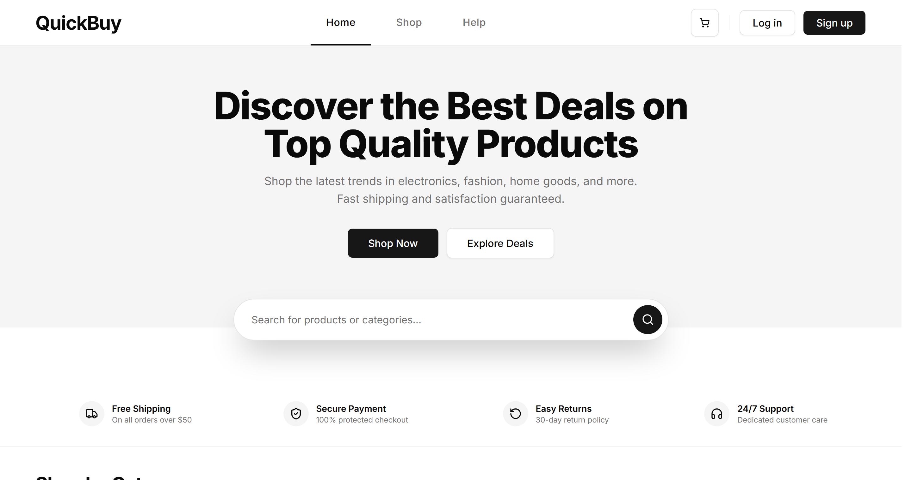

### 2.2 Consistency

_The same patterns — naming, icons, layout, interaction behaviour — should be
used everywhere, so users never have to relearn the interface._

Product listings across the whole application — the curated home-page rows, the
shop grid, the favourites page, and the related-products carousel — are rendered
by one `ProductCard` component (`components/home/product-card.tsx`), which
composes shared `StarRating`, `ProductImage`, discount-badge and favourite-toggle
pieces. Spacing, corner radius, the position of the discount badge and the heart,
the star treatment and the price formatting are therefore identical in every
context. Radii derive from a single `--radius` token, every icon comes from one
icon set, and every button is the one `Button` component with a fixed set of
variants. A user who has learned to read one product card has learned to read all
of them.

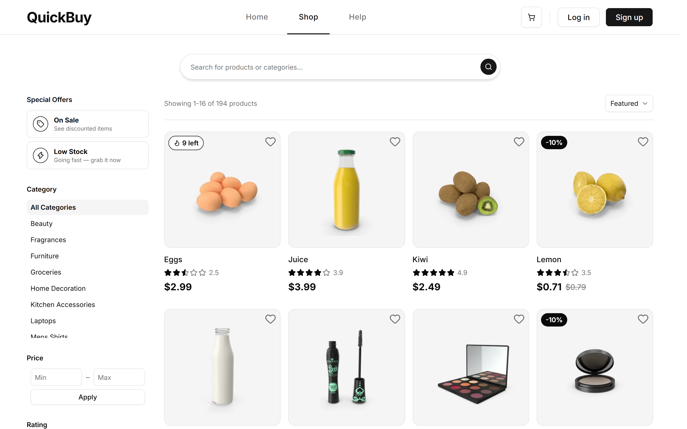

### 2.3 Proximity

_Related items are grouped together; unrelated items are separated by
whitespace, so that layout itself communicates structure._

The shop filter sidebar (`components/shop/shop-sidebar.tsx`) is organised into
labelled blocks — "Special Offers", "Category", "Price", "Rating" — with generous
vertical spacing between blocks and tight spacing within them. Each control sits
directly beneath the heading that names it, and the "Reset Filters" action is set
apart at the foot of the group. The same principle governs the forms: in the
sign-up and login forms (`components/auth/`), every field's label sits
immediately above its input and any validation message appears immediately
below it, so the label, the field, and its error read as one unit.

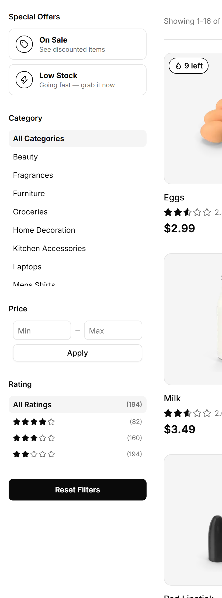

### 2.4 Feedback

_Every action should produce immediate, legible feedback; long operations should
show progress; and destructive actions should be reversible._

Route transitions render dedicated skeleton screens
(`app/(site)/shop/loading.tsx`, `app/(site)/products/[id]/loading.tsx`) that
mirror the shape of the page being loaded. Changing a filter or sort option on
the shop page is a same-route URL change, which React does not treat as a
navigation and would otherwise leave the grid visually frozen; a small
`ShopPendingProvider` / `ShopResultsGate` pair (`components/shop/`) marks the
interaction as pending the instant a control is clicked and swaps in the
product-grid skeleton until the new results arrive. Adding an item to the cart
opens a confirmation popover from the cart icon
(`components/header/cart-button.tsx`) showing the item, quantity, running item
count and subtotal, and the cart badge increments. Removing a cart line item
does not prompt for confirmation; it removes the item at once and offers an
"Undo" action that restores it to its original position (`restoreItem` in
`lib/cart/cart-context.tsx` re-inserts at the stored index). Synchronisation
failures, checkout, sign-up and password reset all raise toast notifications
(`components/ui/toast.tsx`).

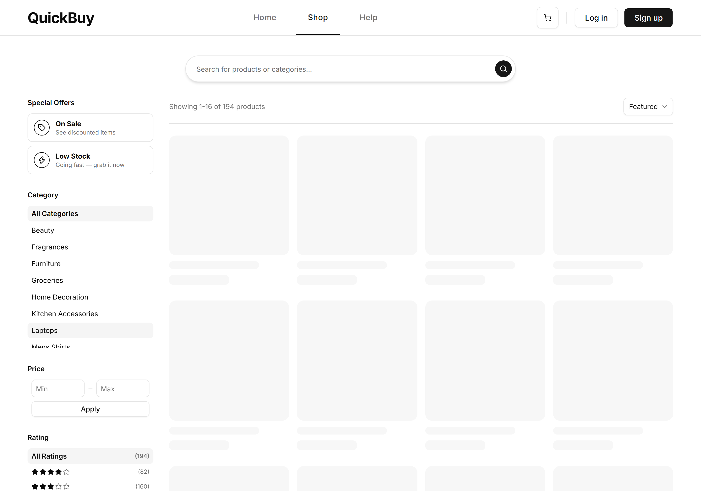

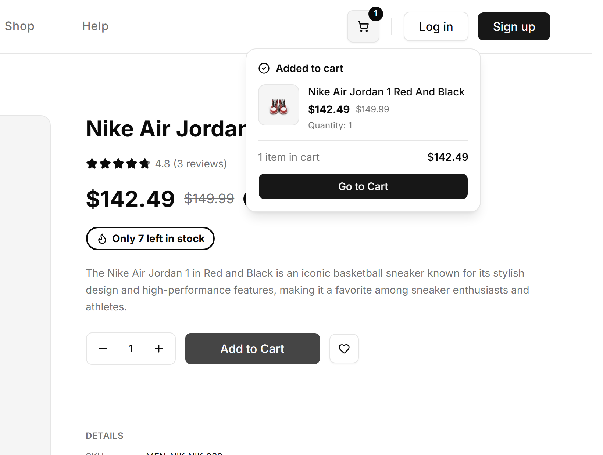

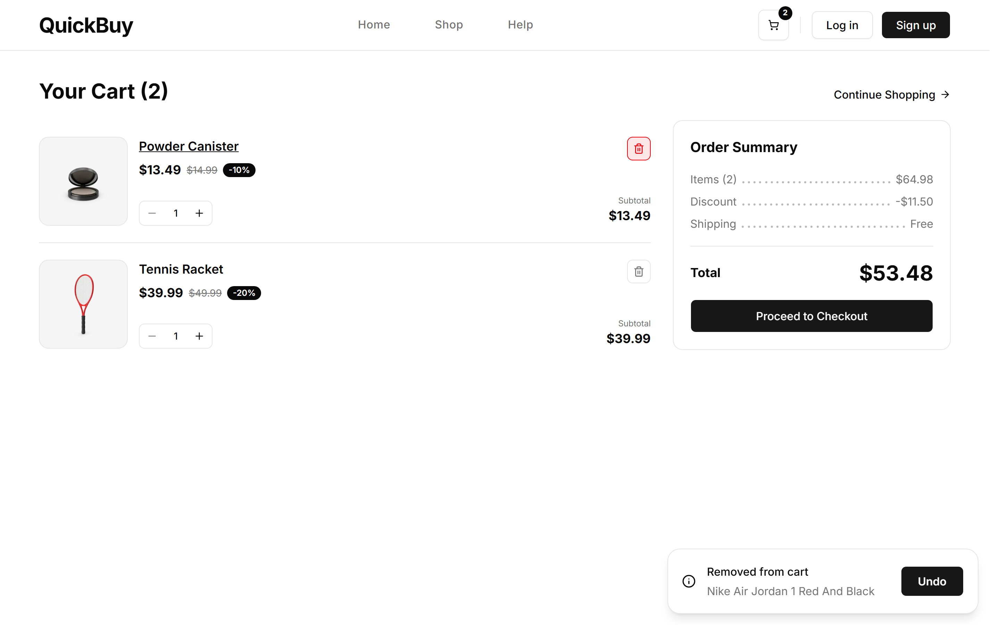

### 2.5 Visibility

_Users should be able to see the current system state, the actions available to
them, and the likely consequence of those actions._

Every active filter on the shop page is echoed back as a removable chip above the
results (`components/shop/active-filter-chips.tsx`), next to a plain-language
count such as "Showing 1–1 of 1 products", so the current query is always legible
and every part of it can be undone in place. The rating filter shows, for each
threshold, how many products would remain if it were chosen, so the consequence
of the choice is visible before it is made. The search field
(`components/search/search-autocomplete.tsx`) never presents an empty box to be
filled from memory: as the user types it surfaces matching categories and
products with thumbnails and prices, plus an explicit "View all results" row,
making the available paths visible rather than recalled.

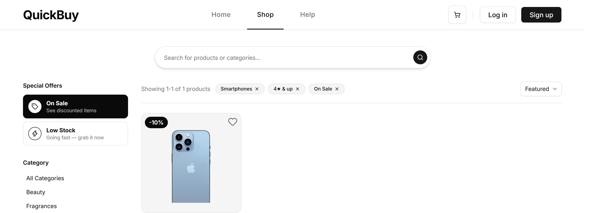

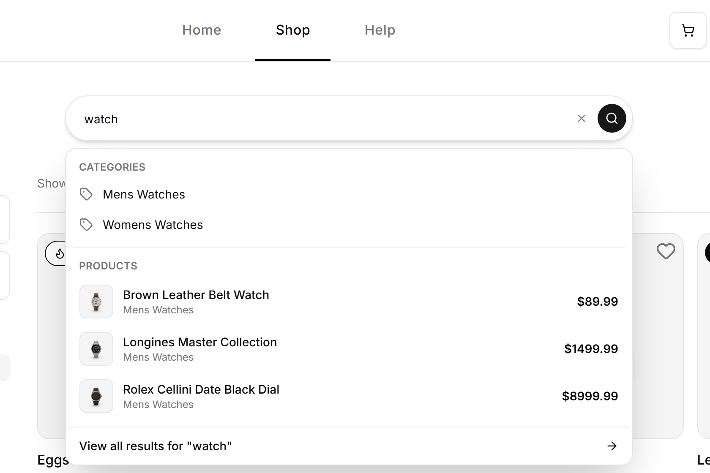

### 2.6 Constraints

_Prevent invalid actions from being possible, rather than reporting them after
the fact._

Quantity is clamped to the range 1–10 and never above the item's stock
(`clampCartQty` in `lib/cart/cart-context.tsx`), and the increment and decrement
buttons (`components/products/add-to-cart.tsx`,
`components/cart/cart-line-item.tsx`) disable themselves at the bounds. When an
item is out of stock the "Add to Cart" button is disabled and relabelled, and the
quantity stepper is disabled with it, so the impossible action cannot be
attempted. Price fields accept only non-negative numbers. Forms validate before
submitting: the sign-up form requires every field, a well-formed e-mail, a
password of at least eight characters and a matching confirmation, and moves
focus to the first invalid field. Constraints are applied without trapping the
user: a removed cart item is undoable (Section 2.4) and every filter carries an
inline clear control, so no state is a dead end.

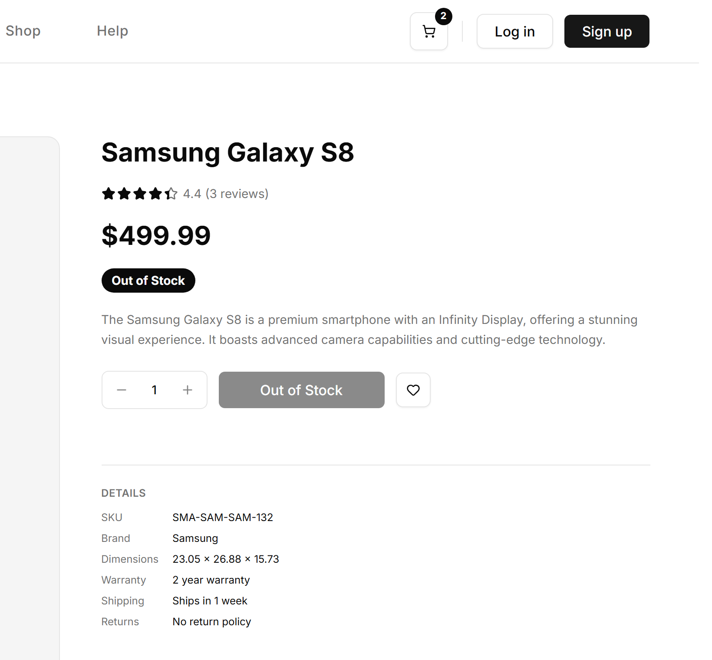

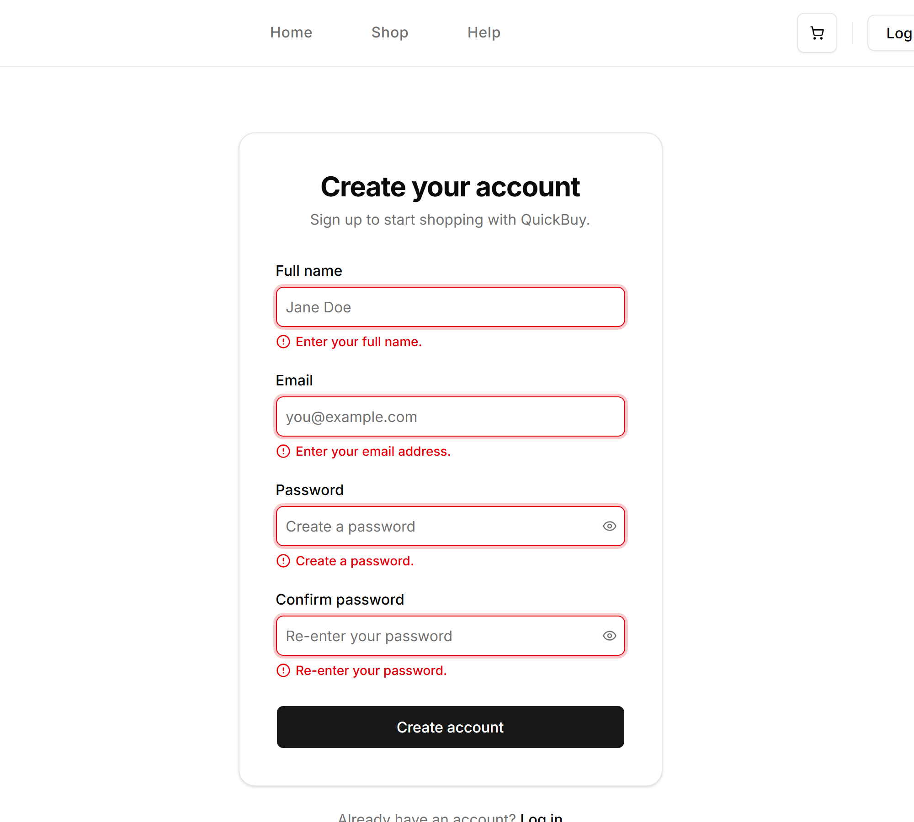

### 2.7 Mental Models

_Design around the conventions users already hold, so they can accurately predict
what a control will do._

QuickBuy leans on patterns a shopper already knows: a cart icon with a numeric
badge, a heart for "save for later", a magnifying glass for search, a breadcrumb
trail that reads from the home page down to the current product, and
plain-language status such as "Only 7 left in stock" and "-5% OFF" rather than
internal terminology. The product detail page
(`components/products/product-info.tsx` and `product-details.tsx`) orders
information the way a shopper reads it: name, then rating, then price and any
discount, then availability, then description, then the purchase controls, with
secondary specifications (SKU, brand, dimensions, warranty, shipping, returns)
presented afterwards as a labelled list. The search field, likewise, behaves as
users expect a search field to behave — remembering recent searches and
recently-viewed items and offering them back when it is focused.

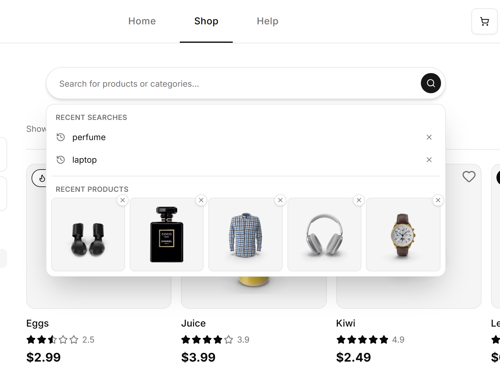

---

## 3. Key Functionalities

### 3.1 The Search Experience

Search is a single reusable component, `SearchAutocomplete`
(`components/search/search-autocomplete.tsx`), used in the home hero, on the shop
page and in the mobile header. It has three behaviours.

_Autocomplete._ As the user types, the query is debounced for 250 ms. Category
names are matched locally; products are fetched by `searchProducts` in
`lib/products.ts`, which runs a case-insensitive substring match against a
generated `search_text` column backed by a trigram index. Each request carries an
`AbortController` signal, so a slow earlier response cannot overwrite a newer
one. The panel shows up to three categories, up to three products, and a
persistent "View all results" row, and is fully keyboard-navigable (arrow keys,
Enter, Escape, with `aria-selected` tracking the highlight).

_Recent searches._ When the field is focused and empty it lists the eight most
recent searches, de-duplicated case-insensitively (`lib/recent-searches.ts`). An
entry is recorded on submit, on selecting a category, or on opening "View all
results", and each can be removed inline.

_Recently-viewed products._ The same empty state shows thumbnails of products the
user recently opened from the dropdown (`lib/recent-products.ts`, capped at ten);
the number shown adapts to the measured width of the field.

For guests both histories live in `localStorage`; for signed-in users they live
in the `recent_searches` and `recent_products` tables
(`lib/recent/recents-context.tsx`). On first login the local histories are merged
into the account and cleared from the browser, so nothing is lost at sign-in.

### 3.2 Shop Filtering and Sorting

The shop page (`app/(site)/shop/page.tsx`) treats the URL query string as the
single source of truth for all filter, sort, search and pagination state. Each
control computes a new URL with `buildShopHref` (`lib/shop-url.ts`), which merges
the change over the current parameters and resets the page. Every view is
therefore shareable, bookmarkable and reachable with the Back button, and the
filtering logic stays on the server.

The filters are: two independent Special Offers toggles ("On Sale", "Low Stock");
a single-select Category list; a minimum/maximum Price pair (on the desktop
sidebar a plain `GET` form, so it works without JavaScript); and a Rating
threshold of 4, 3 or 2 stars and up, each showing a live count of matching
products in the current result set (computed before the rating filter is
applied, so the counts reflect the rest of the query). Sorting offers seven
orders: Featured (the default), price and rating ascending and descending, and
name A–Z and Z–A, with all price comparisons using the discounted price.

On mobile the same controls appear in a slide-up drawer
(`components/shop/mobile-shop-filters.tsx`) that applies changes on one press.
Active filters are always shown as removable chips
(`components/shop/active-filter-chips.tsx`). Out-of-stock products are sorted to
the end of the result set regardless of order, so they appear only on the last
page. Results paginate in steps of sixteen, and the grid hides trailing cards at
narrow breakpoints so the last row is always full. Internally `getShopProducts`
fetches the whole 194-product catalogue once from an hour-cached response and
does all filtering, faceting, sorting and pagination in the application layer.

### 3.3 Add to Cart and Favourites

_Cart._ Cart state is a reducer in `lib/cart/cart-context.tsx`. For guests it is
persisted to `localStorage`; for signed-in users it is persisted to the
`cart_items` table, with local state updated optimistically and an asynchronous
upsert or delete sent to the database (a failed write raises a throttled toast
and is retried). Quantities are clamped to 1–10 and to stock. Adding an item
opens the confirmation popover, and removing one offers undo (both in
Section 2.4). When a guest signs in, their local cart is merged into any server
cart by summing quantities per product, and the local copy is cleared. "Proceed
to Checkout" is a stub.

_Favourites._ Favourites are logged-in only — there is no guest list and nothing
to merge. `lib/favorites/favorites-context.tsx` loads the user's favourited
product IDs and exposes an optimistic `toggleFavorite` that rolls back on error.
The heart appears on product cards
(`components/products/product-card-favorite.tsx`) and on the detail page
(`components/products/favorite-button.tsx`); a filled heart means saved. When a
guest presses a heart they see a prompt to log in or sign up, and the product ID
is saved to `sessionStorage` (ten-minute expiry) so that, if they do log in, the
item is favourited automatically on return. The `/favorites` page is guarded on
the client (no middleware): a guest is redirected to login with a return path,
and a user whose session has ended is sent home.

---

## 4. Data Layer: Supabase

### 4.1 Why Supabase

The product data was originally read at request time from the public DummyJSON
API. That approach ties the application to whatever query shapes a fixed public
endpoint happens to offer, provides no way to add server-side filtering or
search, and makes the data neither owned nor durable. Moving the catalogue into
the project's own database removes all three limitations.

Supabase was chosen because it packages the specific services this project needs
behind one managed platform and a single client library:

- **A managed PostgreSQL database** with a full SQL feature set, so arbitrary
  `WHERE` and `ORDER BY` clauses, generated columns, trigram indexing for
  search, check constraints, and triggers are all available.
- **An automatically generated REST interface (PostgREST)** and a typed
  JavaScript client, so no bespoke API server has to be written or deployed.
- **Row-Level Security**, so per-user data isolation is enforced by the database
  itself rather than by application code.
- **Built-in authentication (Supabase Auth)**, so user accounts, sessions and
  token refresh are handled by the same platform that stores the data.
- **Generated TypeScript types** for the schema, and a migration workflow whose
  files are committed alongside the application source
  (`supabase/migrations/`).

The free tier is sufficient for a project of this size, and the single-platform
approach keeps the catalogue, the user accounts, and the per-user data
consistent with one another.

### 4.2 What the Database Stores

The schema is defined across the migration files in `supabase/migrations/`. It
has two parts.

**The public, read-only catalogue:**

- **`categories`** — 24 rows: a URL-friendly `slug` (primary key) and a display
  `name`.
- **`products`** — 194 rows. Each row keeps the DummyJSON `id` as its natural
  primary key (this identifier is what appears in `/products/[id]` routes) and
  stores the title, description, a foreign key to `categories`, price,
  discount percentage (stored as the already-applied percentage), rating, stock,
  brand, SKU, a thumbnail URL, an array of image URLs, a JSON dimensions object,
  and the warranty, shipping and return-policy text. A generated `search_text`
  column holds a lower-cased concatenation of title, description and brand and is
  indexed with a trigram GIN index to support substring search. An
  `updated_at` timestamp is maintained by a trigger.
- **`product_reviews`** — 582 rows: a foreign key to `products` (cascading on
  delete), a rating, the comment text, the reviewer's name and e-mail, and the
  review date.

**The per-user data (all keyed by the authenticated user's ID):**

- **`cart_items`** — one row per user–product pair, with a quantity constrained
  to 1–10.
- **`recent_products`** — one row per user–product pair with a `viewed_at`
  timestamp; a trigger prunes each user's rows to the ten most recent.
- **`recent_searches`** — the query text (length-constrained), a generated
  lower-cased `query_key` with a uniqueness constraint per user for
  case-insensitive de-duplication, and a `searched_at` timestamp; a trigger
  prunes each user to the eight most recent.
- **`favorites`** — one row per user–product pair with a `created_at` timestamp.

User accounts themselves are not in these tables. They live in the
authentication provider's own `auth.users` store; the per-user tables reference
that store by foreign key and cascade when an account is deleted. Three demo
accounts are seeded by a migration (there is no sign-up path), and each carries a
first name, last name and full name in its user metadata. No editorial or
marketing content is stored in Supabase — that is the responsibility of the CMS
described in Section 5.

### 4.3 Schema Diagram

---

## 5. Content Layer: Headless CMS

### 5.1 Why a Headless CMS Was Used

A portion of the site is editorial rather than transactional: the wording of the
home-page hero and promotional banner, the items in the trust bar, the entire
Help Center (introduction, FAQ groups, policy summaries, support channels), the
footer's tagline and link columns, and the site's default SEO title and
description. This content changes on a different schedule from the code, and it
should be editable by someone who is not a developer and without triggering a
deployment.

A _headless_ CMS serves this need by storing content as structured, typed data
and exposing it over an API, while leaving all rendering to the application. The
CMS therefore imposes no templates or front-end of its own; the same content
could be consumed by more than one client; and content edits are fully decoupled
from code releases.

**Sanity** specifically was chosen because its content model is defined as code
(TypeScript schema files that are versioned alongside the application), its
editing environment is a React application that can be embedded directly into the
host site, it has a capable query language (GROQ) with a generator that produces
TypeScript types for each query's result, it integrates with Next.js through the
official `next-sanity` package, and its free tier is adequate for this project.

### 5.2 What Is Stored in the CMS

The CMS holds four documents, each a **singleton** — that is, each is edited
through one fixed document and cannot be duplicated or deleted from the editing
interface (this is enforced in `sanity.config.ts` and `sanity/structure.ts`):

- **Site settings** — the default SEO title, the default meta description, and an
  optional social-share image.
- **Home page** — the hero (heading, subheading, and a primary and secondary
  call-to-action, each a label and a link), the promotional banner (small
  eyebrow label, heading, body, call-to-action), and the trust-bar items (each
  an icon chosen from a fixed list, a title, and a description).
- **Help center** — an introduction (heading and body), a list of FAQ groups
  (each with a title, an anchor identifier for in-page navigation, and a list of
  question/answer pairs), a list of policies (icon, title, summary), and a list
  of support channels (icon, title, description, and a contact detail).
- **Footer** — a tagline, a list of link columns (each a title and a list of
  labelled links), and a list of social links (a platform chosen from a fixed
  list, and a URL).

Any images referenced by this content are served from Sanity's asset CDN, whose
host is allowed in the Next.js image configuration. No product, pricing,
inventory or user data is held in the CMS.

---

## 6. Site Performance

Performance was treated as a design constraint from the start rather than a later
optimisation pass. The main contributors are:

- **Server-first rendering.** Most pages are React Server Components: product data
  is fetched and the HTML assembled on the server, so the browser receives
  meaningful content in the first response and downloads only a small amount of
  JavaScript. The `"use client"` boundary is drawn narrowly — around the cart,
  search, favourites and filter controls — so interactive code is not shipped for
  the static parts of a page.
- **Cached backend reads.** Every catalogue query is wrapped so its response
  enters the Next.js Data Cache with an hourly revalidation window
  (`lib/supabase.ts`), and every CMS read is cached indefinitely and refreshed
  only by a webhook (`lib/sanity/fetch.ts`). Most page views are therefore served
  without any call to Supabase or Sanity.
- **Streaming and skeletons.** Route-level `loading.tsx` files let the page shell
  and above-the-fold content stream immediately while data resolves, which keeps
  First Contentful Paint low and shows a shaped placeholder instead of a blank
  screen.
- **Image optimisation.** All product and CMS imagery is served through
  `next/image` (wrapped by `components/product-image.tsx`), which returns
  correctly sized images in a modern format, lazy-loads anything below the fold,
  and reserves each image's box in advance so it cannot shift the layout when it
  loads.
- **Font optimisation.** The Geist and Inter families are loaded through
  `next/font`, which self-hosts the files, removes the render-blocking request to
  a font host, and swaps the face in without a layout jump.
- **Layout-shift avoidance.** The scrollbar gutter is reserved on every page
  (`scrollbar-gutter: stable` in `app/globals.css`), images and skeletons carry
  fixed dimensions, and the shop grid hides orphan cards rather than reflowing —
  so Cumulative Layout Shift stays at or near zero.
- **Lightweight client bundle.** The UI is built on small Base UI primitives
  rather than a heavy component framework, and shop filtering is expressed as
  ordinary URL navigation handled on the server (the price filter is a plain
  `GET` form that works with JavaScript disabled), which keeps Total Blocking
  Time small.

The three main page types were audited with **PageSpeed Insights**
(<https://pagespeed.web.dev/>). All three return a Performance score of 99–100
alongside top or near-top Accessibility, Best Practices and SEO scores, with
First Contentful Paint at 0.3 s and Cumulative Layout Shift at or near 0 on every
page.

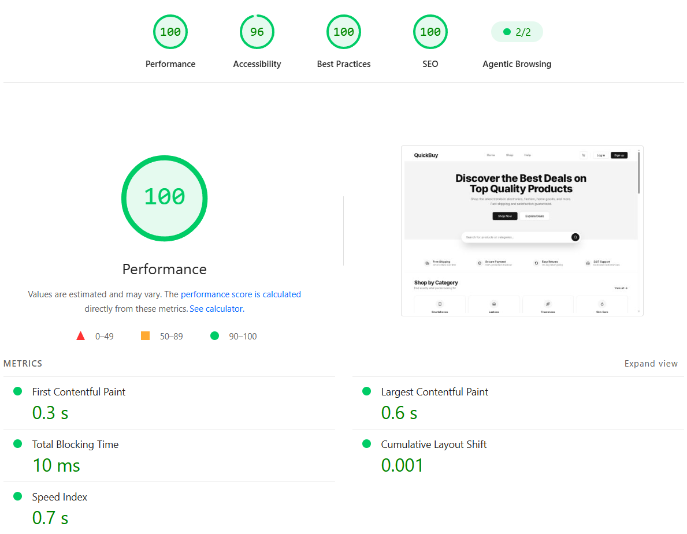

_Home page._ A Performance score of 100. The hero and trust bar are
server-rendered, so First Contentful Paint (0.3 s) and Largest Contentful Paint
(0.6 s) are both well inside the "good" range and Total Blocking Time (10 ms) is
effectively nil.

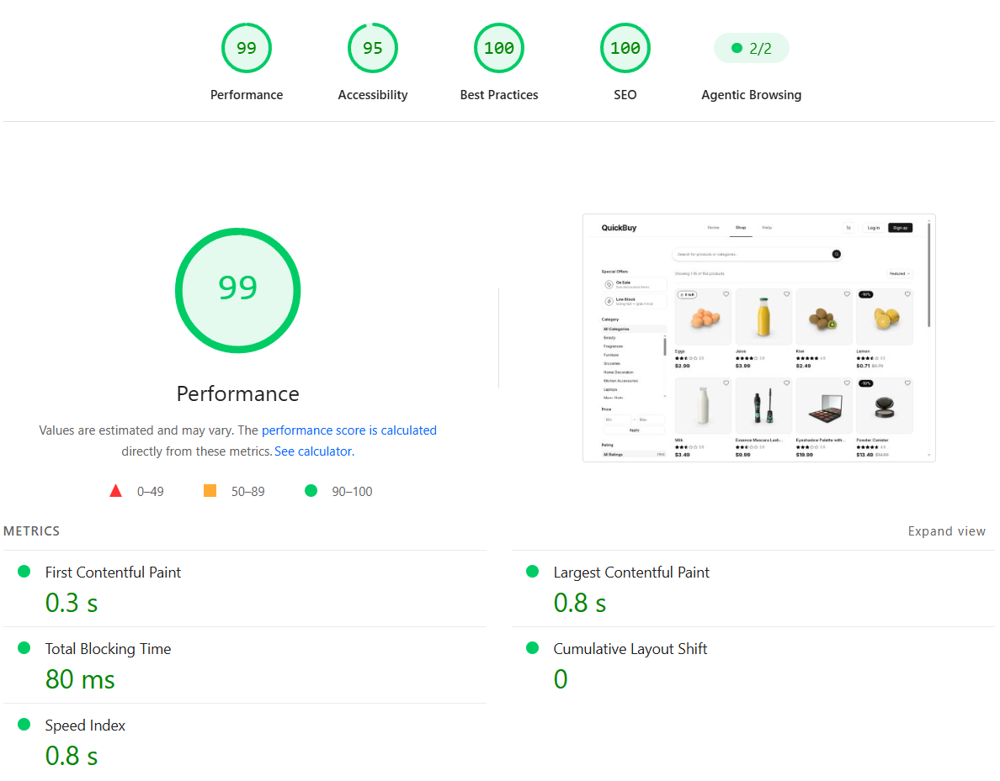

_Shop page._ A Performance score of 99 — the lowest of the three, because this
page ships the most interactive code (the filter sidebar, sort control, search
field and pending-state gate), which lifts Total Blocking Time to 80 ms. The
product grid still renders on the server and Cumulative Layout Shift is 0.

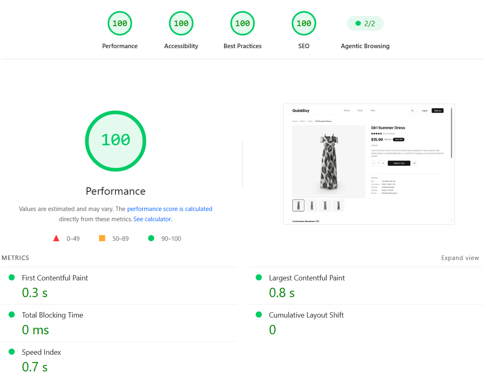

_Product page._ A perfect 100 across all four categories. The image gallery,
specifications and review summary are server-rendered; the only client code is
the add-to-cart and favourite controls, so Total Blocking Time is 0 ms, and the
gallery's reserved image boxes hold Cumulative Layout Shift at 0.

---

## 7. Summary

QuickBuy is an e-commerce web application built to counter the incidental
complexity of mainstream online stores, with particular concern for users who are
less comfortable with dense or unconventional interfaces. It delivers a complete
browsing and selection experience — a curated home page, a shop page with search,
filtering, sorting and pagination, and product detail pages — while deliberately
leaving sign-up, checkout and review submission as non-functional stubs.

The interface follows a small set of principles drawn from the CRAP visual rules
and Norman's interaction principles. A strictly monochromatic palette forces
hierarchy to be carried by size, weight and spacing and keeps the interface
legible in grayscale; one shared `ProductCard` and one `Button` component give
every screen a consistent vocabulary; grouped, labelled filter blocks and
label-above-input forms express structure through proximity; skeleton screens, an
"added to cart" popover, toasts and an undo action provide continuous feedback;
active-filter chips and result counts keep system state visible; bounded quantity
controls, disabled out-of-stock actions and pre-submit validation prevent invalid
input; and familiar commerce conventions let users predict what each control will
do.

Three functional areas were examined in detail. Search is a single reusable
component providing debounced, cancellable autocomplete over categories and
products plus per-user recent searches and recently-viewed items, held in browser
storage for guests and merged into the account on login. Shop filtering and
sorting are entirely URL-driven, so every view is shareable and the logic stays
on the server, with live rating facet counts and out-of-stock demotion. The cart
works anonymously in browser storage and synchronises optimistically to the
database once the user signs in, and favourites are a logged-in feature with a
deferred "save after login" flow.

The data layer is a single managed Supabase project: a public, read-only
catalogue of 194 products, 24 categories and 582 reviews, plus per-user tables
for the cart, favourites and history, isolated by Row-Level Security and keyed to
Supabase Auth accounts. Editorial content — hero copy, the trust bar, the Help
Center, the footer and SEO metadata — is managed in a Sanity headless CMS as four
singleton documents, edited through a Studio embedded in the same application.

Performance was a constraint throughout: server-first rendering, cached backend
reads, streaming with skeletons, `next/image` and `next/font`, and disciplined
layout-shift avoidance. PageSpeed Insights returns a Performance score of 99–100
on the home, shop and product pages, with First Contentful Paint at 0.3 s and
Cumulative Layout Shift at or near zero throughout.
